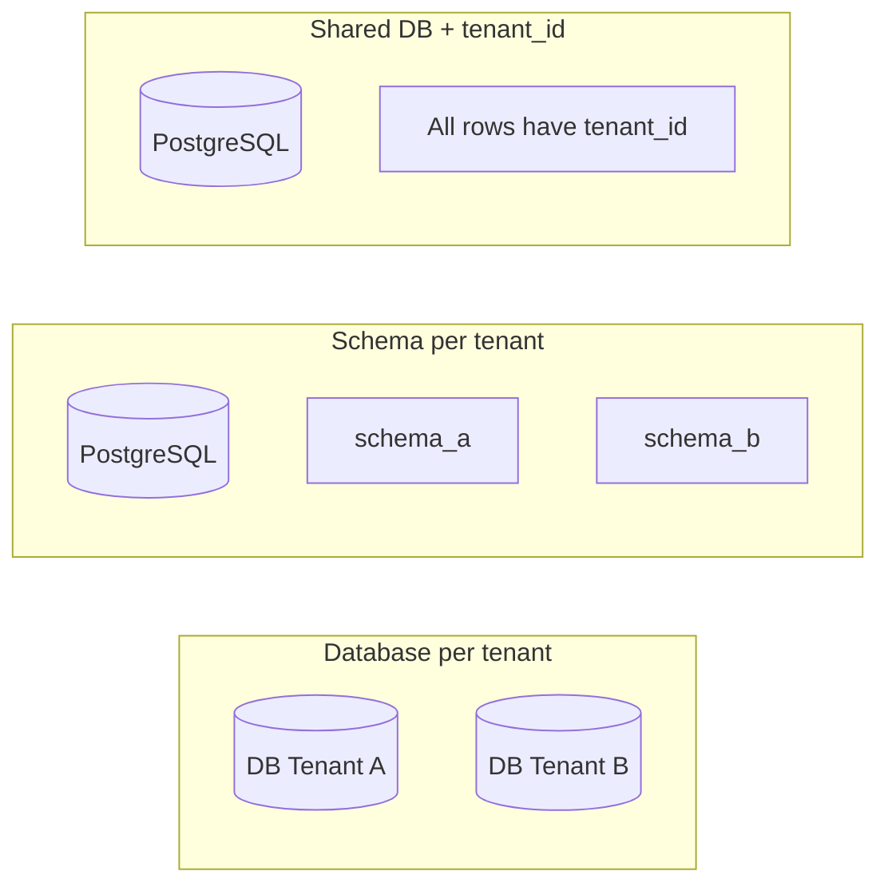
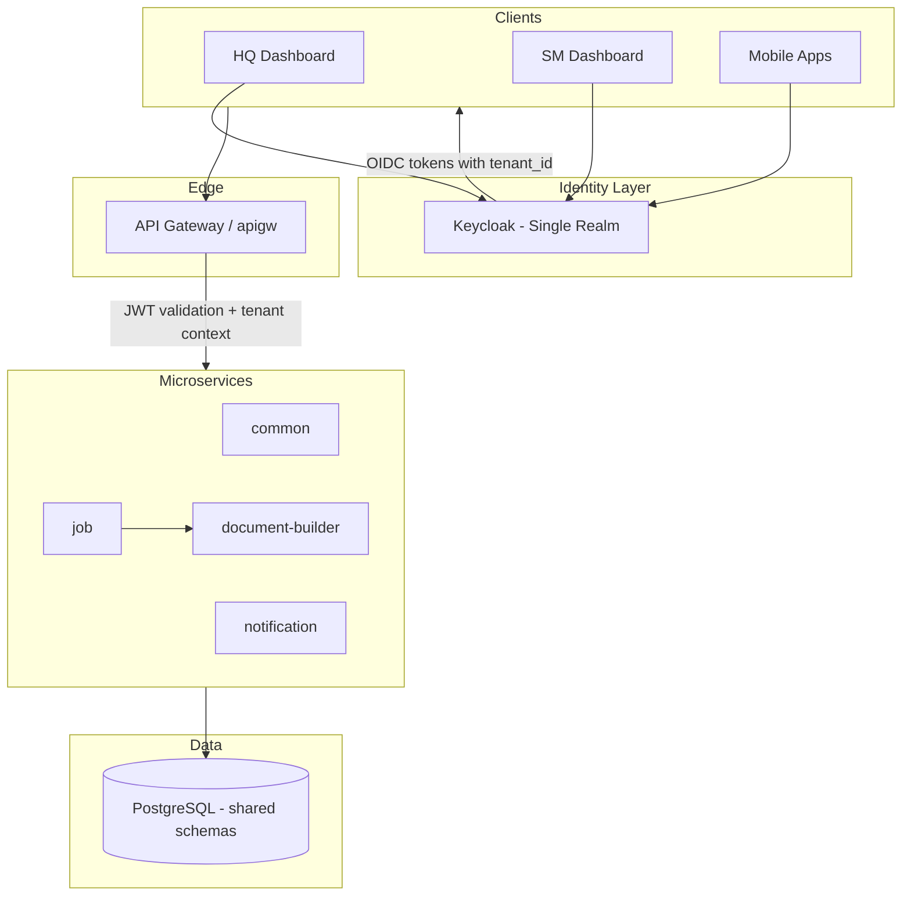
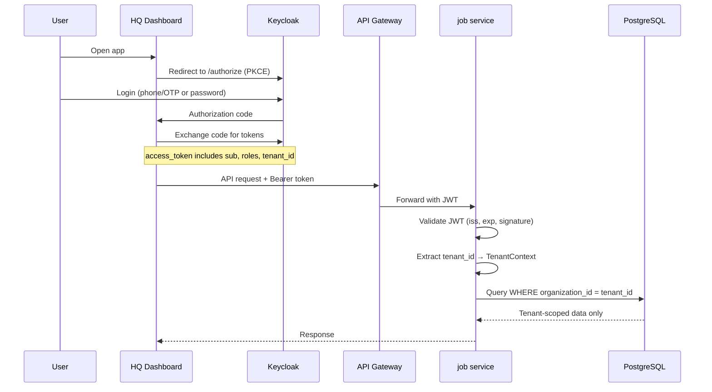
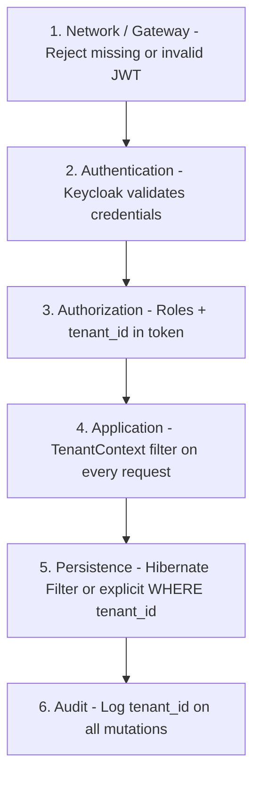
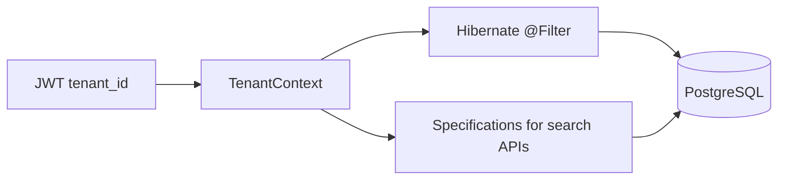

# Multi-Tenant Architecture

---

**Agenda**

1. [What is multi-tenant architecture?](#1-what-is-multi-tenant-architecture)
2. [Why we need it — business and technical benefits](#2-why-we-need-it)
3. [How it is typically implemented](#3-how-multi-tenancy-is-typically-implemented)
4. [Our proposed approach](#5-our-proposed-approach)
5. [Technology stack](#6-technology-stack)
6. [Authentication and tenant isolation](#7-authentication-and-tenant-isolation)
7. [Persistence-layer isolation — `@Filter` vs Specifications](#8-persistence-layer-isolation-filter-vs-specifications)
8. [Key considerations and challenges](#9-key-considerations-and-challenges)
9. [Proposed roadmap](#10-proposed-roadmap)

---

## 1. What Is Multi-Tenant Architecture?

### Simple definition

**One platform, many customers — with strong separation between them.**

Multi-tenant architecture means a **single deployed application** serves **multiple independent customers** (tenants). Each tenant's data, configuration, and users are isolated from others, while the platform shares the same infrastructure, codebase, and operations.

**Analogy:** One apartment building (platform), many separate units (tenants). Tenants share the building's plumbing and security, but each unit has its own lock and private space.

**In our context:** A tenant maps naturally to an **Organization** — the company that posts shifts, manages branches, runs payroll, and signs contracts.

### Technical definition (for engineers)


| Concept            | Meaning                                                        |
| ------------------ | -------------------------------------------------------------- |
| **Tenant**         | An isolated customer boundary (for us: Organization)           |
| **Multi-tenancy**  | One deployment serves many tenants with enforced isolation     |
| **Tenant context** | The active tenant for a request (who owns this data?)          |
| **Isolation**      | Guarantees that Tenant A cannot read or modify Tenant B's data |


**Not the same as:**

- **Multi-instance** — separate deployment per customer (higher cost, simpler isolation)
- **Organization selection in UI only** — user picks an org in the dashboard, but the backend does not enforce tenant identity globally

---

## 2. Why We Need It

### Business value (leadership)


| Benefit                           | What it means for Zerotech                                     |
| --------------------------------- | -------------------------------------------------------------- |
| **Faster onboarding**             | New organizations go live without new infrastructure           |
| **Lower cost per customer**       | Shared compute, DB, and ops instead of per-customer stacks     |
| **Consistent product experience** | One codebase, one release cycle, one support model             |
| **Scalable revenue**              | Platform economics improve as tenant count grows               |
| **Enterprise readiness**          | Strong isolation and auditability expected by larger clients   |
| **Compliance & trust**            | Clear data boundaries support GDPR, SOC2, and contractual SLAs |


**Bottom line:** Multi-tenancy turns our product from "software we run for each client" into a **true SaaS platform**.

### Technical value (engineering)


| Benefit                              | Impact                                                                          |
| ------------------------------------ | ------------------------------------------------------------------------------- |
| **Centralized identity**             | One IdP (Keycloak) instead of custom JWT logic in every service                 |
| **Consistent authorization**         | Tenant + role enforced uniformly, not per-endpoint                              |
| **Reduced duplication**              | No copy-paste auth/isolation logic across `common`, `job`, `notification`, etc. |
| **Safer APIs**                       | Tenant context in every request reduces cross-tenant data leaks                 |
| **Easier observability**             | Logs, traces, and metrics tagged by tenant                                      |
| **Foundation for white-label / SSO** | Per-tenant branding, federation, and policies become feasible                   |


---

## 3. How Multi-Tenancy Is Typically Implemented

### Three common isolation models




| Model                       | Isolation              | Cost    | Complexity        | Best for                                     |
| --------------------------- | ---------------------- | ------- | ----------------- | -------------------------------------------- |
| **Database per tenant**     | Strongest              | Highest | High ops overhead | Regulated / enterprise with strict isolation |
| **Schema per tenant**       | Strong                 | Medium  | Medium            | Mid-size SaaS with moderate tenant count     |
| **Shared DB + `tenant_id`** | Good (with discipline) | Lowest  | Lower             | High tenant count, shared product features   |


**Industry default for SaaS:** Shared database with a `tenant_id` (or equivalent) on every tenant-owned row, enforced at the application and/or database layer

### Identity models (IAM layer)

Two common patterns with Keycloak:


| Pattern                              | How it works                                                | Pros                                             | Cons                                             |
| ------------------------------------ | ----------------------------------------------------------- | ------------------------------------------------ | ------------------------------------------------ |
| **Realm per tenant**                 | Each tenant gets its own Keycloak realm                     | Strong IAM isolation, custom branding per tenant | Hard to scale operationally at high tenant count |
| **Single realm + `tenant_id` claim** | One realm; JWT carries tenant identity via protocol mappers | Fits our existing Organization model; easier ops | Requires strict app-layer enforcement            |


---

**Next:** [Where we are today](where-we-are-today.md) — honest baseline of our current platform.

---

## 5. Our Proposed Approach

### Recommended strategy

**Recommended: Shared database + Organization as tenant + Keycloak with `tenant_id` claim**

This fits our current data model and minimizes migration risk.


| Layer                         | Approach                                                                                                                            |
| ----------------------------- | ----------------------------------------------------------------------------------------------------------------------------------- |
| **Business tenant**           | `Organization` entity (existing)                                                                                                    |
| **Data isolation**            | Shared PostgreSQL + `organization_id` / tenant FK on all tenant-owned data (mostly already present via Branch → Organization chain) |
| **Identity**                  | Keycloak as central IdP (replace custom JWT)                                                                                        |
| **Token**                     | JWT includes `tenant_id` (and optionally `organization_ids[]` for multi-org users)                                                  |
| **Request context**           | Spring filter/interceptor resolves tenant from JWT; all queries scoped automatically                                                |
| **Cross-service propagation** | Gateway or shared library passes tenant context; document-builder pattern standardized                                              |


**Why not realm-per-tenant (for now):**

- Higher operational cost as tenant count grows
- Our Organization model already provides the business boundary
- Can revisit for enterprise/regulated tenants later as an optional tier

### Target architecture




**Principles:**

1. **Authenticate once** — Keycloak issues tokens
2. **Authorize everywhere** — every service validates JWT + tenant scope
3. **Isolate by default** — no query without tenant filter
4. **Defense in depth** — gateway validates; services re-validate

### Phased migration (reduces risk)


| Phase                            | Scope                                                                                    | Outcome                                 |
| -------------------------------- | ---------------------------------------------------------------------------------------- | --------------------------------------- |
| **Phase 1 — Foundation**         | Deploy Keycloak; define realm, clients, roles; add `tenant_id` protocol mapper           | IdP ready; tokens carry tenant identity |
| **Phase 2 — Auth migration**     | Spring OAuth2 Resource Server in `common` + `job`; HQ dashboard uses OIDC                | Custom JWT retired for web clients      |
| **Phase 3 — Tenant enforcement** | Tenant context filter; audit/fix public endpoints; Hibernate filters or repository specs | Systematic data isolation               |
| **Phase 4 — Standardization**    | Extend pattern to `notification`, `document-builder`, mobile; gateway-level validation   | Full platform consistency               |
| **Phase 5 — Hardening**          | Audit logging, tenant-scoped metrics, penetration testing, runbooks                      | Production-grade multi-tenancy          |


---

## 6. Technology Stack


| Layer                | Technology                                  | Role in multi-tenancy                                 |
| -------------------- | ------------------------------------------- | ----------------------------------------------------- |
| **Backend**          | Java 17, Spring Boot 2.5, Spring Cloud      | Microservices, tenant filters, OAuth2 resource server |
| **Identity**         | Keycloak (prototype: v20; client libs: v26) | Central auth, roles, custom claims (`tenant_id`)      |
| **API security**     | Spring Security OAuth2 Resource Server      | JWT validation via `issuer-uri`                       |
| **Database**         | PostgreSQL (per-service DBs today)          | Shared schema + tenant FK / filters                   |
| **Gateway**          | Spring Cloud Gateway (`apigw`)              | Optional central JWT + tenant validation              |
| **Frontend**         | React (HQ/SM dashboards), Vite, TanStack    | `keycloak-js` or OIDC client; org context from token  |
| **Document service** | NestJS + TypeORM                            | Already tenant-aware via `tenant_alias` header        |
| **Messaging**        | RabbitMQ                                    | Tenant ID in message headers for async flows          |
| **Observability**    | Zipkin, Eureka                              | Tenant tags on traces and logs                        |
| **Infrastructure**   | Docker, K8s (Minikube manifests), CI/CD     | Keycloak HA, secrets management                       |


**Spring Boot integration:**

```yaml
spring:
  security:
    oauth2:
      resourceserver:
        jwt:
          issuer-uri: https://auth.zerotech.mn/realms/parttime
```

---

## 7. Authentication and Tenant Isolation

### Authentication flow (OIDC)




**For leadership:** Users log in once; the system knows who they are and which organization they belong to — automatically, on every request.

**For engineers:** Replace custom JWT validation with OIDC JWKS validation and a `TenantContext` populated from JWT claims.

### What goes in the token?


| Claim                | Purpose                         | Example                  |
| -------------------- | ------------------------------- | ------------------------ |
| `sub`                | User ID                         | `"uuid-1234"`            |
| `realm_access.roles` | Global roles                    | `["admin"]`              |
| `tenant_id`          | Active organization             | `"org-456"`              |
| `organization_ids`   | Orgs user can access (optional) | `["org-456", "org-789"]` |
| `employee_type`      | Branch role (optional)          | `"OWNER"`, `"MANAGER"`   |


Configured in Keycloak via **Protocol Mappers**.

**Multi-org users (owners/managers with several organizations):**

1. User authenticates
2. If multiple orgs → org picker (existing HQ flow)
3. Token/session updated with selected `tenant_id`
4. All subsequent API calls scoped to that tenant

### Tenant isolation layers

Defense in depth — no single layer is enough:




| Layer                | Responsibility                                                       |
| -------------------- | -------------------------------------------------------------------- |
| **Gateway**          | Block unauthenticated traffic; optional tenant header validation     |
| **Service security** | `@PreAuthorize`, role checks, tenant match                           |
| **Repository / ORM** | Automatic tenant filter on all reads/writes                          |
| **Async (RabbitMQ)** | Propagate `tenant_id` in message metadata                            |
| **document-builder** | Standardize on JWT-derived tenant (replace ad-hoc header-only trust) |


### Mapping to our domain model

```
Tenant (= Organization)
  └── Branch
        └── BranchEmployee (User + EmployeeType)
              └── Shift, Salary, Contract, Requirements...
```

Most tenant-owned data already chains to `Organization` via `Branch.organization_id`. The work is to **enforce** that chain on every code path, not to redesign the schema from scratch. See [§8](#8-persistence-layer-isolation-filter-vs-specifications) for how we enforce isolation at the persistence layer.

---

## 8. Persistence-Layer Isolation: `@Filter` vs Specifications

Two common ways to enforce `organization_id` / `tenant_id` at the database access layer in our Spring services. They work well together — `@Filter` for default entity scoping, Specifications for dynamic search and list APIs.

### Quick comparison


| Approach                       | Where it runs           | Applies to                                | Best for                                            |
| ------------------------------ | ----------------------- | ----------------------------------------- | --------------------------------------------------- |
| **Hibernate `@Filter`**        | ORM (Hibernate Session) | Entities annotated with `@Filter`         | Automatic scoping on all JPQL/Criteria/entity loads |
| **Spring Data Specifications** | Repository layer        | Queries built through `Specification` API | Explicit, composable filters; good testability      |


|                                                               | Hibernate `@Filter`                                               | Spring Data Specifications                            |
| ------------------------------------------------------------- | ----------------------------------------------------------------- | ----------------------------------------------------- |
| **Safety if dev forgets a WHERE**                             | High for annotated entities                                       | Medium — only where spec is used                      |
| **Native SQL / `@Query` bypass risk**                         | Yes — native queries ignore filters                               | Yes — raw `@Query` strings bypass specs               |
| **Admin / cross-tenant queries**                              | Disable filter per session                                        | Omit spec in dedicated admin repos                    |
| **Indirect tenant path** (e.g. Shift → Branch → Organization) | Awkward — filter on join columns or denormalize `organization_id` | Flexible — join in spec                               |
| **Performance**                                               | Small overhead per query; filter param bound once per session     | Depends on spec complexity                            |
| **Migration effort**                                          | Medium — annotate entities, enable filter on every request        | Medium — refactor repos to use specs                  |
| **Works across 4 service DBs**                                | Per-service Java library                                          | Per-service Java library                              |
| **Debugging**                                                 | "Why is this row missing?" → check if filter enabled              | Clear — spec visible in code                          |
| **Fit for Zerotech (Phase 3)**                                | **Recommended primary** for `job` / `common` JPA entities         | **Recommended** for complex/search queries            |


**Recommendation for us:** Start with **`TenantContext` + Hibernate `@Filter`** on tenant-owned entities (denormalize `organization_id` on hot tables like `Shift` where the join chain is deep). Use **Specifications** for search/list endpoints that already compose dynamic criteria.

---

### 1. Hibernate `@Filter`

A session-scoped SQL fragment automatically appended to queries for annotated entities.

**Entity example** (denormalized `organization_id` on `Shift` — avoids join in every query):

```java
@Entity
@Table(name = "shift")
@FilterDef(name = "tenantFilter", parameters = @ParamDef(name = "organizationId", type = "uuid-char"))
@Filter(name = "tenantFilter", condition = "organization_id = :organizationId")
public class Shift {

    @Id
    private UUID id;

    @Column(name = "organization_id", nullable = false, updatable = false)
    private UUID organizationId;

    @ManyToOne(fetch = FetchType.LAZY)
    private Branch branch;

    // ...
}
```

**Enable on every request** (after JWT → `TenantContext`):

```java
@Component
public class TenantFilterInterceptor implements HandlerInterceptor {

    private final EntityManager entityManager;

    @Override
    public boolean preHandle(HttpServletRequest request, HttpServletResponse response, Object handler) {
        UUID tenantId = TenantContext.requireOrganizationId();
        Session session = entityManager.unwrap(Session.class);
        session.enableFilter("tenantFilter")
               .setParameter("organizationId", tenantId);
        return true;
    }
}
```

**Set tenant on insert** (filter does not auto-populate new rows):

```java
@PrePersist
void setTenant() {
    if (organizationId == null) {
        organizationId = TenantContext.requireOrganizationId();
    }
}
```

**Admin bypass:**

```java
session.disableFilter("tenantFilter"); // only for audited ADMIN paths
```


| Pros                                                           | Cons                                                                                 |
| -------------------------------------------------------------- | ------------------------------------------------------------------------------------ |
| Transparent — `findById`, lazy loads, and JPQL all scoped      | **Native SQL** and some bulk operations bypass filters                               |
| One annotation per entity; hard to forget in standard JPA code | Indirect paths (Shift → Branch → org) need denormalized column or custom condition   |
| Filter disabled/enabled per session — clean admin escape hatch | Must enable filter on **every** request thread (including async — propagate context) |
| Works with existing repositories without rewriting queries     | Spring Boot 2.5 / Hibernate 5.x — test filter activation in integration tests        |


---

### 2. Spring Data JPA Specifications

Composable `Predicate`s added to every repository call that uses them.

**Tenant spec** (direct column or join chain):

```java
public final class TenantSpecs {

    private TenantSpecs() {}

    // Direct organization_id on entity
    public static <T extends TenantOwned> Specification<T> forCurrentTenant() {
        return (root, query, cb) ->
            cb.equal(root.get("organizationId"), TenantContext.requireOrganizationId());
    }

    // Indirect: Shift → Branch → organization
    public static Specification<Shift> shiftBelongsToCurrentTenant() {
        return (root, query, cb) ->
            cb.equal(
                root.join("branch").get("organization").get("id"),
                TenantContext.requireOrganizationId()
            );
    }
}
```

**Repository:**

```java
public interface ShiftRepository extends JpaRepository<Shift, UUID>,
                                         JpaSpecificationExecutor<Shift> {

    // Safe — caller must pass tenant spec
    List<Shift> findAll(Specification<Shift> spec);

    // UNSAFE without spec — returns all tenants!
    List<Shift> findByStatus(ShiftStatus status);
}
```

**Service usage:**

```java
@Service
public class ShiftService {

    public List<Shift> listOpenShifts() {
        Specification<Shift> tenant = TenantSpecs.shiftBelongsToCurrentTenant();
        Specification<Shift> open = (root, q, cb) ->
            cb.equal(root.get("status"), ShiftStatus.OPEN);
        return shiftRepository.findAll(tenant.and(open));
    }
}
```

**Base repository pattern** (reduces "forgot the spec" risk):

```java
@NoRepositoryBean
public interface TenantScopedRepository<T, ID> extends JpaRepository<T, ID>,
                                                      JpaSpecificationExecutor<T> {

    default List<T> findAllForTenant(Specification<T> spec) {
        return findAll(TenantSpecs.forCurrentTenant().and(spec));
    }
}
```


| Pros                                                       | Cons                                                                      |
| ---------------------------------------------------------- | ------------------------------------------------------------------------- |
| Explicit and readable in code reviews                      | Easy to call `findByXxx()` without a spec — **no compile-time guarantee** |
| Great for dynamic search (status + date + branch + tenant) | Every query path must be audited                                          |
| Easy to unit test predicates in isolation                  | Join-chain specs can be slower than denormalized `organization_id`        |
| No Hibernate-specific APIs — portable JPA                  | Does not protect native `@Query` unless you add tenant to the SQL string  |


---

### Combined approach (recommended roadmap)




| Phase       | Action                                                                                          |
| ----------- | ----------------------------------------------------------------------------------------------- |
| **Phase 3** | `TenantContext` filter + `@Filter` on core entities; denormalize `organization_id` where needed |
| **Phase 3** | Migrate dynamic list/search endpoints to `Specification.and(tenantSpec)`                        |
| **Ongoing** | Negative tests: user A's token must never return user B's `organization_id` rows                |


---

## 9. Key Considerations and Challenges

### For leadership (risks and mitigations)


| Challenge                     | Business impact                              | Mitigation                                          |
| ----------------------------- | -------------------------------------------- | --------------------------------------------------- |
| **Migration from custom JWT** | Possible client downtime during auth cutover | Phased rollout; parallel auth period; feature flags |
| **Data leakage risk**         | Reputational and legal damage                | Tenant filters + security audit + penetration test  |
| **Increased complexity**      | Longer initial delivery                      | Phased roadmap; start with `job` + `common`         |
| **Keycloak operations**       | New infrastructure to run                    | Docker/K8s deployment; backup; monitoring           |
| **Multi-org users**           | UX friction if org selection breaks          | Reuse existing org picker; persist in token         |


### For engineers (technical challenges)


| Challenge                       | Detail                                        | Approach                                             |
| ------------------------------- | --------------------------------------------- | ---------------------------------------------------- |
| **Public endpoints**            | Many `job` routes are currently `permitAll()` | Audit all endpoints; tenant-scope or authenticate    |
| **Commented-out role matchers** | Spring Security config incomplete             | Re-enable with Keycloak role mapping                 |
| **4 separate PostgreSQL DBs**   | Tenant context must propagate across services | Shared tenant library in `common` / `clients` module |
| **Mobile clients**              | Must migrate from custom JWT to OIDC          | Mobile SDK update; refresh token handling            |
| **Cross-service calls**         | Feign clients need tenant propagation         | Pass JWT or internal service token with tenant claim |
| **Background jobs**             | No HTTP request context                       | Inject tenant from job payload or scheduler context  |
| **Admin / cross-tenant ops**    | Platform admins need global access            | Separate `ADMIN` role bypass with audit trail        |
| **Testing**                     | Must prove no cross-tenant leaks              | Integration tests with two tenants; negative tests   |


### Decision summary


| Decision              | Recommendation                             | Rationale                                 |
| --------------------- | ------------------------------------------ | ----------------------------------------- |
| Tenant definition     | `Organization`                             | Already in domain model                   |
| Data model            | Shared DB + FK chain                       | Minimal schema migration                  |
| IAM                   | Keycloak, single realm                     | Aligns with prototypes and PPT            |
| Token strategy        | `tenant_id` claim                          | Scales operationally                      |
| Isolation enforcement | `@Filter` + Specifications                  | App-layer enforcement in Phase 3          |
| Gateway role          | Validate JWT centrally                     | Reduces duplicated logic                  |


---

## 10. Proposed Roadmap


| Quarter | Milestone                                                                         |
| ------- | --------------------------------------------------------------------------------- |
| **Q1**  | Keycloak production deployment; realm/clients/roles; developer demo               |
| **Q2**  | `common` + HQ dashboard OIDC migration; `tenant_id` in tokens                     |
| **Q3**  | `job` service tenant enforcement; endpoint security audit                         |
| **Q4**  | Mobile migration; notification + document-builder standardization; security audit |


*Adjust dates to your actual planning cycle.*

**Success metrics:**

- 100% of authenticated API calls carry validated `tenant_id`
- Zero cross-tenant incidents in QA penetration tests
- Custom JWT fully deprecated
- New organization onboarding requires no engineering deployment

---

---

