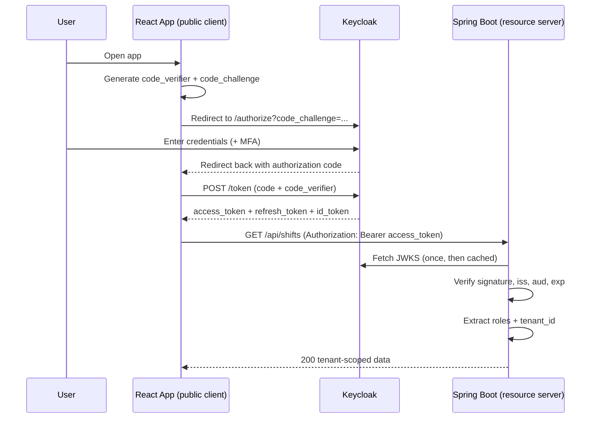
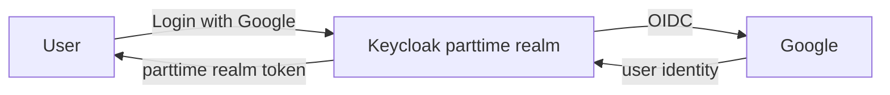
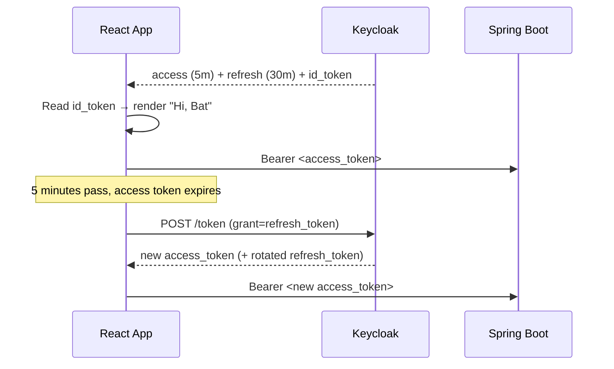
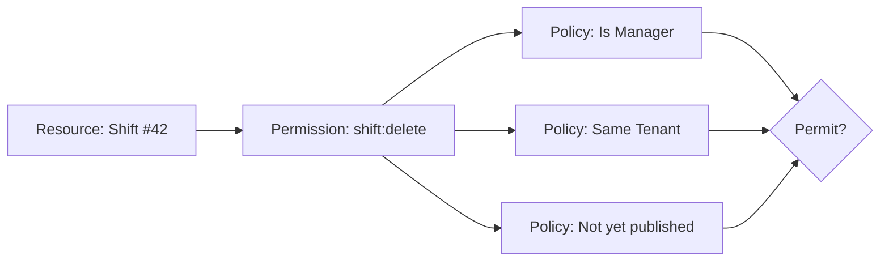

# Keycloak in Practice

[← Back to overview](index.md)

---

This page goes beyond definitions. It explains **how Keycloak actually works** when you wire it into a real frontend + backend, how each concept shows up in day-to-day code, and **which authorization strategy to reach for** in our multi-tenant platform.

If you only need the high-level auth flow, see [§7 of the overview](index.md#7-authentication-and-tenant-isolation). This page is the deep dive.

### A login URL, concretely

Everything below starts with one redirect. This is the exact URL a client sends a user to in order to begin the Authorization Code flow:

```
http://localhost:8888/realms/demo/protocol/openid-connect/auth
  ?client_id=talk-tech-client
  &response_type=code
  &scope=openid
  &redirect_uri=http://localhost:8888
```

| Part                                    | Meaning                                                                 |
| --------------------------------------- | ----------------------------------------------------------------------- |
| `localhost:8888`                        | Keycloak server                                                         |
| `/realms/demo`                          | The **realm** (here `demo`; ours is `parttime`)                         |
| `/protocol/openid-connect/auth`         | The OIDC **authorize endpoint** — renders the login page                |
| `client_id=talk-tech-client`           | Which **client** is asking (must be registered in the realm)            |
| `response_type=code`                    | Use the **Authorization Code** flow — return a code, not a token        |
| `scope=openid`                          | Request OIDC → we get an **ID token** back (add `tenant` for our claims) |
| `redirect_uri=http://localhost:8888`    | Where Keycloak sends the user back **with the code** (must be allowlisted) |

After the user logs in, Keycloak redirects to `redirect_uri?code=...`; the client then exchanges that code for tokens at the **token endpoint**. A production client also adds `code_challenge` (PKCE) and a `state` parameter — see the full flow in [§2](#2-architecture-and-the-auth-flow).

---

**Agenda**

1. [What Keycloak is and where it sits](#1-what-keycloak-is-and-where-it-sits)
2. [Architecture and the auth flow](#2-architecture-and-the-auth-flow)
3. [Real-world usage — frontend and backend](#3-real-world-usage-frontend-and-backend)
4. [Core concepts with practical examples](#4-core-concepts-with-practical-examples)
5. [Tokens — access, refresh, and ID](#5-tokens-access-refresh-and-id)
6. [Authorization strategies — RBAC vs fine-grained](#6-authorization-strategies-rbac-vs-fine-grained)
7. [Recommendations for Zerotech](#7-recommendations-for-zerotech)

---

## 1. What Keycloak Is and Where It Sits

**Keycloak is an open-source Identity and Access Management (IAM) server.** It does three jobs so your apps don't have to:

- **Authentication** — proving *who* a user is (login, MFA, social login, SSO)
- **Authorization** — deciding *what* they can do (roles, permissions, policies)
- **Token issuance** — handing out signed, verifiable tokens that carry identity and permissions to every service

It speaks the **OAuth 2.0** and **OpenID Connect (OIDC)** standards, plus SAML. Because it's standards-based, any compliant client library (Spring Security, `keycloak-js`, `oidc-client-ts`, mobile SDKs) talks to it the same way.

---

## 2. Architecture and the Auth Flow

### Internal architecture

Keycloak is a Java application (Quarkus-based since v17) that persists its configuration and users in a relational database. The pieces you interact with:

| Component               | What it does                                                                    |
| ----------------------- | ------------------------------------------------------------------------------- |
| **Realm**               | Isolated tenant of Keycloak itself — its own users, clients, roles, keys        |
| **Auth server / SSO**   | Renders login pages, runs authentication flows, manages browser SSO sessions    |
| **Token service**       | Issues and refreshes OAuth2/OIDC tokens, signs them with the realm's private key |
| **Admin REST API**      | Programmatic management (create users, roles, clients) — used by automation      |
| **Account Console**     | Self-service UI where users manage their own profile, sessions, credentials     |
| **User federation**     | Connects to external user stores (LDAP, Active Directory)                        |
| **Identity brokering**  | Delegates login to external IdPs (Google, Microsoft, another Keycloak)           |
| **Database**            | Stores realms, clients, users, roles, sessions (PostgreSQL in production)        |

Each realm publishes a **discovery document** at:

```
https://auth.zerotech.mn/realms/parttime/.well-known/openid-configuration
```

That document tells clients where the authorize endpoint, token endpoint, and **JWKS** (public signing keys) live. Resource servers fetch the JWKS to verify token signatures **offline** — no per-request call back to Keycloak.

### The standard login flow — Authorization Code + PKCE

This is the flow for browser and mobile apps. **PKCE** (Proof Key for Code Exchange) protects public clients that can't keep a secret.



**Why the code-then-exchange dance?** The authorization code travels through the browser URL (less sensitive); the actual **tokens** are fetched server-to-server-style over a direct HTTPS POST, so they never sit in a redirect URL or browser history. PKCE binds the code to the client that started the flow, defeating code-interception attacks.

---

## 3. Real-World Usage — Frontend and Backend

The two sides have opposite jobs: the **frontend logs the user in and carries the token**; the **backend never logs anyone in — it only validates the token and authorizes the request.**

### Frontend (React dashboards, mobile)

The frontend is a **public client**. Using `keycloak-js`, it redirects to Keycloak at startup (`onLoad: "login-required"` + `pkceMethod: "S256"`), then attaches `Bearer ${keycloak.token}` to every API call, calling `keycloak.updateToken()` first to silently refresh:

```ts
api.interceptors.request.use(async (config) => {
  await keycloak.updateToken(30); // refresh if expiring within 30s
  config.headers.Authorization = `Bearer ${keycloak.token}`;
  return config;
});
```

What the frontend owns:

- **Tokens in memory**, not `localStorage` (XSS-exfiltration risk) — `keycloak-js` does this by default.
- **Silent refresh** before requests or on a timer.
- **Logout** via `keycloak.logout()` so the Keycloak SSO session ends, not just local state.
- **Org switching** — re-scope the token after the org picker for multi-org users.
- **UI-only role checks** — `keycloak.hasRealmRole("MANAGER")` hides buttons, nothing more.

> **Rule:** client-side role checks are for **UX only**. They are trivially bypassed; the backend must re-check every request.

### Backend (Spring Boot resource servers)

The backend is a **resource server**. One config line points it at the realm; Spring then fetches the JWKS and validates `iss`, `exp`, and signature on every request automatically:

```yaml
spring.security.oauth2.resourceserver.jwt.issuer-uri: https://auth.zerotech.mn/realms/parttime
```

From there the backend:

- **Maps roles to authorities** — Keycloak nests them under `realm_access.roles`, so a small `JwtAuthenticationConverter` turns each into a `ROLE_*` authority.
- **Enforces access** with `@PreAuthorize("hasRole('MANAGER')")` on endpoints.
- **Reads the tenant claim** — `jwt.getClaim("tenant_id")` → `TenantContext`, which drives the persistence filter ([overview §8](index.md#8-persistence-layer-isolation-filter-vs-specifications)).

```java
@GetMapping
@PreAuthorize("hasRole('MANAGER')")
public List<ShiftDto> list(@AuthenticationPrincipal Jwt jwt) {
  TenantContext.set(UUID.fromString(jwt.getClaim("tenant_id")));
  return shiftService.listForCurrentTenant();
}
```

**Service-to-service calls** (`job` → `notification`, or background jobs with no user) use a **service account** token instead of a user token — see [§4](#service-account).

---

## 4. Core Concepts with Practical Examples

Every example below is framed in our domain: **Organization = tenant**, with HQ/SM dashboards and the `common`/`job`/`notification` services.

### Realm

A **realm** is a fully isolated space: its own users, clients, roles, and signing keys. Users in one realm cannot log into another.

- **Our choice:** a **single realm** named `parttime` for all organizations, with `tenant_id` distinguishing them (see [overview §3](index.md#3-how-multi-tenancy-is-typically-implemented)). Realm-per-tenant is reserved for future enterprise tiers.
- The `master` realm is admin-only — never put application users there.

```
Realm: parttime
 ├── Clients:  hq-dashboard, sm-dashboard, mobile-app, job-service
 ├── Roles:    ADMIN, OWNER, MANAGER, EMPLOYEE
 ├── Users:    all org users (tenant_id attribute on each)
 └── Keys:     RS256 signing key (rotates)
```

### Client

A **client** is an application that asks Keycloak for tokens. Each app gets its own client entry. The critical split:

| Type             | Keeps a secret? | Examples                          | Flow              |
| ---------------- | --------------- | --------------------------------- | ----------------- |
| **Public**       | No              | React SPA, mobile app             | Auth Code + PKCE  |
| **Confidential** | Yes             | A backend that initiates login, a service account | Code or client-credentials |

- **Public client** — runs on a device the user controls, so it *cannot* hold a secret (anyone can read the JS bundle or decompile the app). Security comes from PKCE + redirect-URI allowlists, **not** a password. → `hq-dashboard`, `mobile-app`.
- **Confidential client** — runs on a server you control, so it can authenticate with a `client_secret`. Required for the client-credentials flow and service accounts. → `job-service`.

> Common mistake: making the React app a confidential client. The secret would be visible in the browser — that's not a secret. SPAs are **always** public + PKCE.

### User

A **user** is a person (or thing) that authenticates. Beyond credentials, a user carries **attributes** — custom key/value data you can map into tokens.

```
User: bat@org456.mn
 ├── credentials: password, OTP
 ├── attributes:  tenant_id = org-456
 │                organization_ids = [org-456, org-789]
 ├── realm roles: MANAGER
 └── groups:      /Org-456/Managers
```

The `tenant_id` **attribute** is what a protocol mapper copies into the JWT so our backend knows which Organization the request belongs to.

### Group

A **group** is a collection of users that bundles role assignments and attributes. Assign roles to the group once; every member inherits them. Groups can nest.

```
/Org-456
 ├── /Owners      → role OWNER,   attribute tenant_id=org-456
 ├── /Managers    → role MANAGER, attribute tenant_id=org-456
 └── /Employees   → role EMPLOYEE, attribute tenant_id=org-456
```

**Practical use:** onboarding a new manager = drop them into `/Org-456/Managers`. They instantly get the `MANAGER` role and the right `tenant_id`. No per-user role wiring.

### Role

A **role** is a named permission label. Two scopes:

| Kind            | Defined on   | Appears in token under   | Use for                                    |
| --------------- | ------------ | ------------------------ | ------------------------------------------ |
| **Realm role**  | The realm    | `realm_access.roles`     | Broad, cross-app roles (`ADMIN`, `MANAGER`) |
| **Client role** | A client     | `resource_access.<client>.roles` | Permissions specific to one app  |

- **Realm role example:** `MANAGER` — meaningful everywhere (job service, dashboards).
- **Client role example:** `report-export` on `hq-dashboard` — only relevant to that app. The `job-service` doesn't care about it.

**Rule of thumb:** start with realm roles. Introduce client roles only when a permission is genuinely app-specific and you don't want it leaking into other services' tokens.

Roles can be **composite** — `OWNER` can include `MANAGER`, so owners get everything managers can do plus more.

### Scope

"Scope" means two related things in Keycloak — don't conflate them:

1. **OAuth scopes / Client Scopes** — control *what goes into the token*. A **client scope** is a reusable bundle of protocol mappers and roles. Example: a `tenant` client scope that adds the `tenant_id` and `organization_ids` claims. Attach it to every client that needs tenant info instead of re-configuring mappers per client.

   ```
   Client scope "tenant" (default)
    ├── mapper: tenant_id        (user attribute → claim)
    └── mapper: organization_ids (user attribute → claim, multivalued)
   ```

2. **Authorization scopes** — in fine-grained authorization, a scope is an *action* you can perform on a resource: `shift:read`, `shift:create`, `shift:delete`. See [Resource](#resource) and [§6](#6-authorization-strategies-rbac-vs-fine-grained).

### Resource

(Fine-grained authorization concept.) A **resource** is a protected thing the user acts on — modeled in Keycloak's Authorization Services. It can be a *type* (`Shift`) or a *specific instance* (`Shift #42`), and it has a set of allowed **scopes** (actions).

```
Resource: "Shift"
 ├── type: urn:parttime:resources:shift
 ├── owner: (optionally the creating user/service account)
 └── scopes: shift:read, shift:create, shift:update, shift:delete, shift:publish
```

You only need resources if you adopt Keycloak Authorization Services. Plain RBAC doesn't use them.

### Permission

(Fine-grained authorization concept.) A **permission** ties a **resource (+scope)** to one or more **policies**. It answers: "to do *this action* on *this resource*, which rules must pass?"

```
Permission: "Delete a shift"
 ├── applies to: resource "Shift", scope "shift:delete"
 └── requires policies: [ "Is Manager", "Same Tenant" ]   (all must pass)
```

### Policy

(Fine-grained authorization concept.) A **policy** is the actual reusable *rule*. Policies evaluate the request context and return permit/deny. Types include:

| Policy type   | Rule based on                                        |
| ------------- | ---------------------------------------------------- |
| **Role**      | User has role X                                      |
| **Group**     | User is in group X                                   |
| **User**      | Specific user                                        |
| **Time**      | Only during a window                                 |
| **JavaScript**| Custom code (e.g. token's `tenant_id` == resource's owner org) |
| **Aggregated**| Combine other policies (AND/OR)                      |

```js
// "Same Tenant" policy (JS) — request tenant must match the resource's org
var tenant = identity.getAttributes().getValue('tenant_id').asString(0);
var resourceOrg = permission.getResource().getAttribute('organization_id');
$evaluation.grant(tenant == resourceOrg);
```

Permissions reference policies, policies are reusable across permissions — that's the composability win.

### Service Account

A **service account** is an identity for a *machine*, not a person. Enable it on a **confidential client** and that client can obtain tokens via the **client-credentials** grant — no user, no browser.

```
Client: job-service (confidential, service account ON)
 → grant: client_credentials
 → service-account roles: SERVICE, notification:send
```

```bash
# job-service getting its own token to call notification
curl -X POST https://auth.zerotech.mn/realms/parttime/protocol/openid-connect/token \
  -d grant_type=client_credentials \
  -d client_id=job-service \
  -d client_secret=$JOB_SERVICE_SECRET
```

**Practical use in our stack:** background contract generation, async RabbitMQ consumers, and cron jobs have **no user request context**. They authenticate as a service account and carry the tenant explicitly in the job payload (see [overview §9 — background jobs](index.md#9-key-considerations-and-challenges)).

### Identity Provider (IdP)

An **IdP** is an external system Keycloak delegates login to (**identity brokering**). The user logs in with Google / Microsoft / a corporate SSO, and Keycloak still issues *its own* `parttime`-realm token afterward — so your backend code never changes.



**Practical use:** an enterprise org wants employees to sign in with their Microsoft Entra ID account. Add Entra as an IdP on the `parttime` realm; map their email/groups to our roles via **mappers**. No new login UI, and tokens still carry our `tenant_id`. This is the foundation for "Login with SSO" enterprise deals.

---

## 5. Tokens — Access, Refresh, and ID

Keycloak issues three tokens. They have **different jobs** and mixing them up is a common source of bugs and vulnerabilities.

| Token             | Format          | Audience (who reads it) | Lifetime  | Carries                                        |
| ----------------- | --------------- | ----------------------- | --------- | ---------------------------------------------- |
| **Access token**  | JWT             | Resource servers (APIs) | Short (~5 min) | Roles, scopes, `tenant_id`, `sub`, `exp` |
| **Refresh token** | Opaque/JWT      | Keycloak only           | Long (~30 min–hours) | Reference to the session             |
| **ID token**      | JWT             | The frontend client     | Short     | User profile: name, email, picture             |

### Purpose of each

- **Access token** — the *key card* you present to APIs. Every backend call carries it in `Authorization: Bearer`. The backend validates it and reads roles + `tenant_id` from it. **It is the only token your APIs should ever look at.**
- **Refresh token** — a *coupon* the frontend redeems at Keycloak's token endpoint to get a fresh access token when the old one expires, **without forcing the user to log in again**. It is never sent to your APIs.
- **ID token** — *proof of who logged in*, for the client's benefit. The frontend reads it to display "Hi, Bat" and the avatar. It is **not** an API authorization credential.

### How they're used in a real app



The user experiences **one login** and a session that stays alive for hours, while each access token lives only minutes — limiting the blast radius if one leaks.

### Common security considerations

| Concern                          | Guidance                                                                                          |
| -------------------------------- | ------------------------------------------------------------------------------------------------- |
| **Never authorize with the ID token** | APIs must reject it. Validate the **access token** only, and check its `aud`/`azp`.          |
| **Short access-token lifetime**  | ~5 min limits damage from a leaked token. Lean on refresh for UX.                                 |
| **Refresh-token rotation**       | Enable rotation + reuse detection — a stolen, replayed refresh token invalidates the session.     |
| **Validate `iss`, `aud`, `exp`, signature** | Always, server-side, against the realm JWKS. Spring does this when `issuer-uri` is set.  |
| **Storage (frontend)**           | Keep tokens in memory. Avoid `localStorage` (XSS reads it). `keycloak-js` defaults to memory.     |
| **Always HTTPS**                 | Tokens are bearer credentials — anyone holding one *is* the user until it expires.                 |
| **Don't trust client-side role checks** | They're for UI only. Re-enforce on the backend every request.                              |
| **Logout / revocation**          | Use Keycloak logout to kill the SSO session; access tokens still expire on their own (they're self-contained). |
| **Minimize claims**              | Only map what services need. Tokens travel widely; don't stuff PII or large lists into them.       |

---

## 6. Authorization Strategies — RBAC vs Fine-Grained

Keycloak supports two models. **You don't have to pick only one** — most systems use RBAC as the baseline and add fine-grained authorization for the few endpoints that need it.

### RBAC (Role-Based Access Control)

Permissions are attached to **roles**; roles are attached to **users/groups**; roles ride in the token. The backend checks "does this token have role X?"

```java
@PreAuthorize("hasRole('MANAGER')")
public void publishShift(UUID shiftId) { ... }
```

**Strengths:** simple, fast (no callback to Keycloak — the role is right there in the JWT), easy to reason about and test, scales to most apps.

**Limits:** roles are coarse. "A manager can edit shifts" is easy. "A manager can edit shifts **of their own branch**, but only **before** they're published" is not expressible with roles alone — you'd explode into dozens of micro-roles.

### Fine-Grained Authorization (Keycloak Authorization Services)

Keycloak becomes a **policy decision point**. You model **resources** + **scopes** (actions), write reusable **policies**, and bind them with **permissions**. The backend asks Keycloak (or evaluates a permission ticket) for a decision on *this specific resource*.



This expresses **attribute- and context-aware** rules: ownership, tenant match, time windows, resource state — without inventing a role per combination.

**Strengths:** highly expressive, centralized rules (change a policy, not redeploy services), great for instance-level and ABAC-style decisions.

**Costs:** more moving parts to model and maintain; a decision often means a call to / token from Keycloak (latency, coupling); harder to debug and test than a role check.

### When to use each

| Use **RBAC** when…                                   | Use **fine-grained** when…                                         |
| ---------------------------------------------------- | ------------------------------------------------------------------ |
| Access depends on the user's **role**                | Access depends on the **specific resource** (owner, branch, state) |
| Rules are coarse: admin vs manager vs employee       | Rules involve **attributes/context**: tenant, time, status         |
| You want speed and no Keycloak round-trip            | You can absorb a policy-decision call                              |
| The role set is small and stable                     | You'd otherwise create a combinatorial explosion of roles          |
| **Most endpoints**                                   | **A few sensitive, instance-level endpoints**                      |

> **Tenant isolation is not the job of either Keycloak strategy alone.** `tenant_id` rides in the token, but the *enforcement* that "this query only returns Org-456's rows" happens at the **persistence layer** (`@Filter` / Specifications — [overview §8](index.md#8-persistence-layer-isolation-filter-vs-specifications)). Keycloak tells you *who* and *which tenant*; your data layer guarantees *isolation*.

---

[← Back to overview](index.md)
