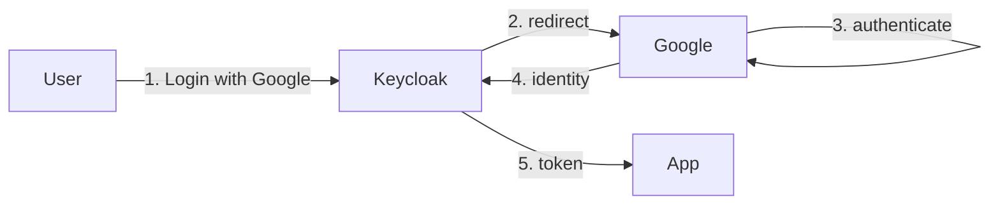
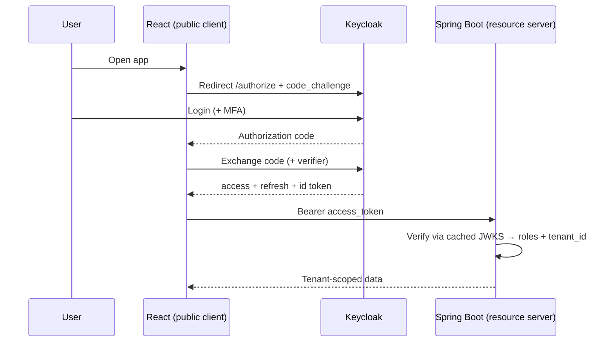
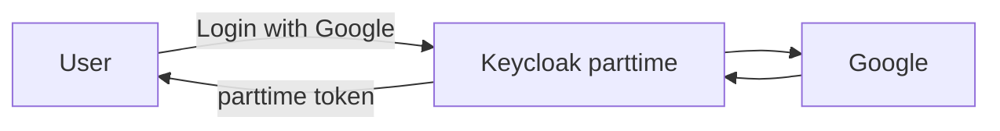
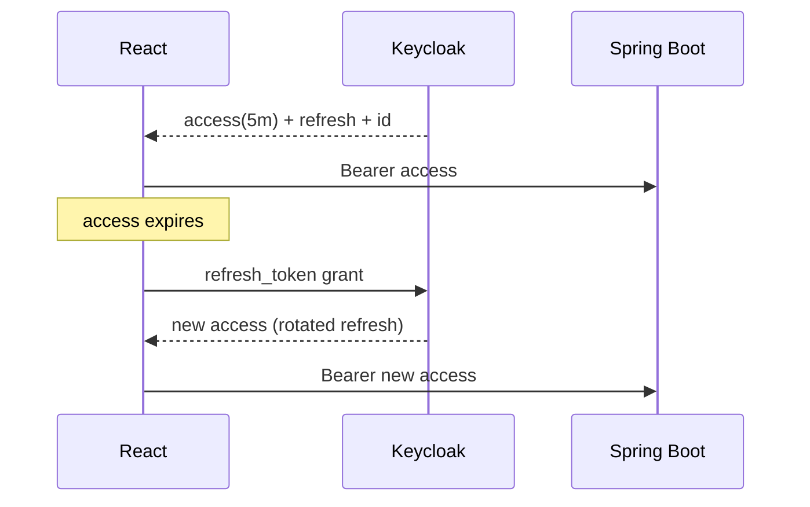
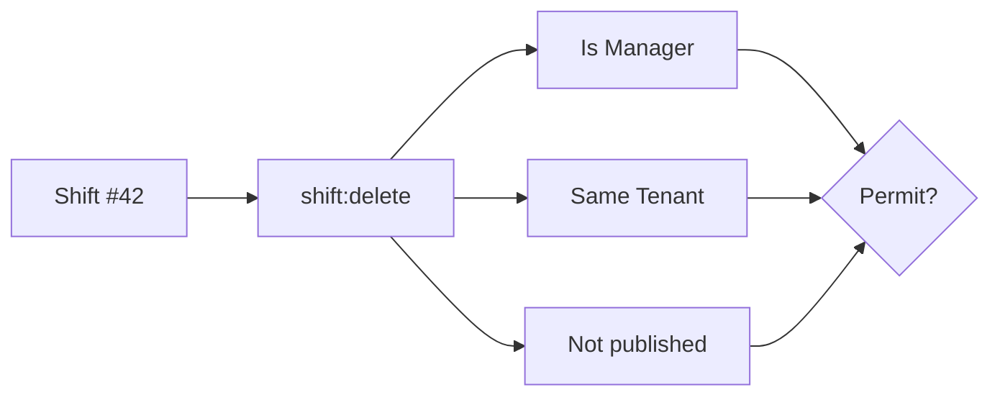

# Keycloak in Practice

[← Back to overview](index.md)

🔗 **Sample login URL:** <a href="http://localhost:8888/realms/demo/protocol/openid-connect/auth?client_id=talk-tech-client&response_type=code&scope=openid&redirect_uri=http://localhost:8888" target="_blank" rel="noopener">open the Keycloak sign-in flow</a>

---

## The deck

1. [What Keycloak is](#1-what-keycloak-is)
2. [OAuth 2.0 & OIDC](#2-oauth-20-oidc)
3. [Architecture & auth flow](#3-architecture-auth-flow)
4. [Core concepts](#4-core-concepts)
5. [The three tokens](#5-the-three-tokens)
6. [RBAC vs fine-grained](#6-rbac-vs-fine-grained)
7. [Frontend vs backend](#7-frontend-vs-backend)

---

## 1. What Keycloak Is

> **One identity service every app trusts — so no app builds its own login.**

Keycloak does three jobs:

- 🔐 **Authentication** — *who* you are (login, MFA, SSO)
- ✅ **Authorization** — *what* you can do (roles, policies)
- 🎟️ **Tokens** — signed proof of both, handed to every service

Speaks **OAuth 2.0 / OIDC** (+ SAML) → any standard client works the same way: Spring Security, `keycloak-js`, mobile SDKs.

---

## 2. OAuth 2.0 & OIDC

> **OAuth 2.0 = authorization (access). OIDC = authentication (identity) layered on top.**

- **OAuth 2.0** — a delegation protocol for *access*. Issues **access tokens** that say *what* a client may do, without ever sharing the user's password. Answers: *"can this app call that API?"*
- **OIDC (OpenID Connect)** — a thin identity layer **on top of** OAuth 2.0. Adds the **ID token** (a JWT about the user), the `/userinfo` endpoint, and the discovery doc. Answers: *"who logged in?"*

| | OAuth 2.0 | OIDC |
| ---------------- | ------------------------ | ----------------------------- |
| **Question**     | What can the app access? | Who is the user?              |
| **Token**        | access token             | + ID token                    |
| **Describes**    | permissions / scopes     | the user's identity           |
| **Scope keyword**| (resource scopes)        | `openid`                      |

Keycloak implements **both** — OIDC *is* OAuth 2.0 plus identity. The `scope=openid` in the **sample login URL** at the top of this page is literally the switch that turns an OAuth flow into OIDC and gets you an ID token back.

---

## 3. Architecture & Auth Flow

> **Keycloak signs tokens; services verify them offline.**

### The pieces

| Component          | Role                                            |
| ------------------ | ----------------------------------------------- |
| **Realm**          | Isolated space: users, clients, roles, keys     |
| **Auth / SSO**     | Login pages + browser session                   |
| **Token service**  | Issues & signs tokens                           |
| **Admin API**      | Programmatic management                          |
| **Federation/IdP** | LDAP, AD, Google, Microsoft                      |

#### Federation / IdP — one system logging in with another system's user identity

**How does federation work?**

1. User clicks **"Login with Google"**
2. Keycloak → redirects to Google
3. Google → authenticates the user
4. Google → returns identity to Keycloak
5. Keycloak → issues a token to the app



→ The app only ever works with Keycloak's token; even if the external IdP changes, **the app code stays the same**.

Each realm publishes a **discovery doc** → tells clients where the endpoints + **JWKS public keys** are. Services cache the JWKS and verify signatures **without calling Keycloak per request**.

### The login flow (Auth Code + PKCE)



**Why two steps?** The code rides the browser URL; the **tokens** are fetched over a direct POST — never exposed in URLs or history. **PKCE** binds the code to the app that started login.

---

## 4. Core Concepts

> **All framed in our domain: Organization = tenant.**

### Realm — isolated space

One realm `parttime` for all orgs; `tenant_id` separates them. (`master` = admin only.)

### Client — an app asking for tokens

| Type             | Secret? | Examples                | Flow             |
| ---------------- | ------- | ----------------------- | ---------------- |
| **Public**       | No      | React SPA, mobile       | Code + PKCE      |
| **Confidential** | Yes     | backend, service account| client-credentials |

> ⚠️ A SPA can't hide a secret → **always public + PKCE.**

### User — who authenticates

Carries **attributes** mapped into tokens — e.g. `tenant_id = org-456`.

### Group — bundle of roles + attributes

Drop a user into `/Org-456/Managers` → they inherit `MANAGER` + the right `tenant_id`. No per-user wiring.

### Role — a permission label

| Kind            | Lives on | In token under            | Use for              |
| --------------- | -------- | ------------------------- | -------------------- |
| **Realm role**  | Realm    | `realm_access.roles`      | Cross-app (`MANAGER`)|
| **Client role** | A client | `resource_access.<c>.roles` | App-specific       |

Start with realm roles. Roles can be **composite** (`OWNER` includes `MANAGER`).

### Scope — two meanings

- **Client scope** → *what goes in the token* (e.g. a reusable `tenant` scope adding `tenant_id`)
- **Authorization scope** → *an action*: `shift:read`, `shift:delete`

### Resource · Permission · Policy *(fine-grained only)*

| Concept        | One-liner                                        |
| -------------- | ------------------------------------------------ |
| **Resource**   | The protected thing — `Shift`, or `Shift #42`    |
| **Scope**      | An action on it — `shift:delete`                 |
| **Policy**     | A reusable rule — *Is Manager*, *Same Tenant*    |
| **Permission** | Binds resource+scope → required policies         |

```
Permission "Delete a shift"
  → resource Shift, scope shift:delete
  → policies: [Is Manager] AND [Same Tenant]
```

### Service Account — identity for a machine

Confidential client + client-credentials grant → a token with **no user**. For background jobs, RabbitMQ consumers, cron.

### Identity Provider (IdP) — login delegated out



User signs in with Google/Microsoft → Keycloak still issues **our** realm token. Backend code unchanged. Foundation for **enterprise SSO**.

---

## 5. The Three Tokens

> **Different jobs — mixing them up is a real vulnerability.**

| Token       | For        | Lifetime | Carries                       |
| ----------- | ---------- | -------- | ----------------------------- |
| **Access**  | APIs       | ~5 min   | roles, `tenant_id`, `sub`     |
| **Refresh** | Keycloak   | ~30 min+ | reference to the session      |
| **ID**      | the frontend | short  | name, email, picture          |

- **Access** = key card → the **only** token APIs read
- **Refresh** = coupon → swaps for a new access token, no re-login
- **ID** = "who logged in" → frontend renders "Hi, Bat"



**One login, hours of session — but each access token lives minutes.**

### Security must-knows

- ❌ Never authorize with the **ID token** — APIs validate the **access** token only
- ✅ Short access lifetime + **refresh rotation** (reuse detection)
- ✅ Validate `iss` / `aud` / `exp` / signature, always server-side
- ✅ Tokens **in memory**, **HTTPS** only, **minimal claims**

---

## 6. RBAC vs Fine-Grained

> **RBAC by default. Fine-grained only where roles can't express the rule.**

#### RBAC — role in the token

```java
@PreAuthorize("hasRole('MANAGER')")
```

✅ Simple, fast, no Keycloak round-trip · ❌ Can't say *"own branch, before published"* without role explosion.

#### Fine-grained — Keycloak decides



✅ Attribute/context-aware, centralized rules · ❌ More moving parts, a decision call per check.

### Pick by the question

| RBAC when…                       | Fine-grained when…                       |
| -------------------------------- | ---------------------------------------- |
| Access depends on **role**       | Access depends on **the specific item**  |
| Coarse: admin / manager / employee | Context: owner, branch, time, status   |
| Want speed, no round-trip        | Can absorb a decision call               |
| **Most endpoints**               | **A few sensitive ones**                 |

---

## 7. Frontend vs Backend

> **Frontend logs in & carries the token. Backend only validates it.**

#### Frontend (React, mobile) — *public client*

- Redirects to Keycloak at startup (`login-required` + PKCE)
- Attaches `Bearer <token>` to every call; refreshes silently first
- Tokens **in memory**, never `localStorage`
- Logout via `keycloak.logout()` (ends SSO session)
- `hasRealmRole()` only **hides buttons** — never security

```ts
api.interceptors.request.use(async (config) => {
  await keycloak.updateToken(30);             // refresh if expiring soon
  config.headers.Authorization = `Bearer ${keycloak.token}`;
  return config;
});
```

#### Backend (Spring Boot) — *resource server*

One line validates every token (`iss`, `exp`, signature via JWKS):

```yaml
spring.security.oauth2.resourceserver.jwt.issuer-uri: https://auth.zerotech.mn/realms/parttime
```

Then: map `realm_access.roles` → authorities, enforce with `@PreAuthorize`, read `tenant_id` → `TenantContext`:

```java
@GetMapping @PreAuthorize("hasRole('MANAGER')")
public List<ShiftDto> list(@AuthenticationPrincipal Jwt jwt) {
  TenantContext.set(UUID.fromString(jwt.getClaim("tenant_id")));
  return shiftService.listForCurrentTenant();
}
```

> ⚠️ Client-side role checks are bypassable. **The backend re-checks every request.**

Machine-to-machine calls (`job` → `notification`) use a **service account** (slide 4), not a user token.

---

[← Back to overview](index.md)
