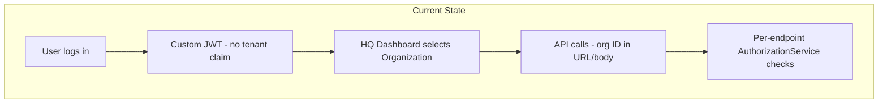

# Where We Are Today

An honest baseline of the Parttime platform before multi-tenant hardening. We support multiple organizations at the <strong>business level</strong> — not yet at the <strong>platform architecture level</strong>.

:material-arrow-left: [Back to overview](index.md) · [Skip to proposed approach →](index.md#5-our-proposed-approach)

---

## Current architecture

### What we have

- Spring Boot microservices: `common`, `job`, `notification`, `log`, `apigw`
- PostgreSQL — separate DB per service, shared schema
- **Organization → Branch → Employee** hierarchy
- Custom JWT auth (HS256, issued by `common`)
- Org selected in HQ dashboard (client-side, localStorage)
- `AuthorizationService` roles (ADMIN, OWNER, MANAGER, etc.)

### Partial patterns

- `document-builder` requires `tenant_alias` header; filters templates by tenant
- `job` passes organization ID as `tenant_alias` for contract generation

### Gaps

- No platform-wide tenant context in tokens
- No systematic row-level isolation across services
- Keycloak not in production (KC 20 Docker + React demo only)
- Tenant propagation beyond document-builder

!!! success "Key message for leadership"
    The org picker in HQ is good UX. The gap is making that choice **authoritative in the security token** and enforced in every service.

:material-arrow-right: **Next** — [Our proposed approach](index.md#5-our-proposed-approach)

