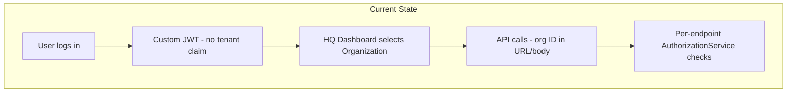

# Where We Are Today

[← Back to overview](index.md)

---

## Current architecture (honest baseline)

**What we have:**

- Spring Boot microservices: `common`, `job`, `notification`, `log`, `apigw`
- PostgreSQL — separate databases per service (`common`, `job`, `notification`, `log`), shared schema
- **Organization → Branch → Employee** business hierarchy
- Custom JWT auth (HS256, issued by `common`)
- Organization selected in HQ dashboard (client-side, localStorage)
- Application-level authorization via `AuthorizationService` (ADMIN, OWNER, MANAGER, etc.)

**Partial tenant pattern already exists:**

- `document-builder` (NestJS) requires a `tenant_alias` header and filters templates by tenant
- `job` service passes organization ID as `tenant_alias` when generating contracts

**What we do not have yet:**

- Platform-wide tenant context in tokens
- Systematic row-level isolation across all services
- Keycloak in production (prototypes exist: KC 20 Docker, React demo)
- Tenant propagation beyond document-builder

**Key message for leadership:** We support multiple organizations today at the **business level**, but not yet at the **platform architecture level**. That gap is what this initiative closes.

---

[Next: Our proposed approach →](index.md#5-our-proposed-approach)
